# Nhật Ký Thay Đổi & Đánh Giá Hiệu Quả

> **Dự án:** Hệ thống điều khiển đèn giao thông thích ứng (GPI + FRAP + MGMQ + PPO)  
> **Ngày bắt đầu:** 2026-01-17  
> **Mô tả:** Ghi lại lịch sử thay đổi và kết quả đánh giá hiệu quả qua từng phiên bản/thử nghiệm.

---

 abcd 
## 📌 Mục Lục
- [Nhật Ký Thay Đổi (Changelog)](#-nhật-ký-thay-đổi-changelog)
- [Đánh Giá Hiệu Quả (Experiments)](#-đánh-giá-hiệu-quả-experiments)
- [Ghi Chú Chung](#-ghi-chú-chung)

---

## Nhật Ký Thay Đổi (Changelog)

### [v1.5.0] - 2026-02-03
#### ✨ Thêm mới (Added)
- **Reward Normalization**: Implement cơ chế chuẩn hóa phần thưởng (z-score normalization) sử dụng `RunningMeanStd` (Welford algorithm) để ổn định quá trình training.
- **Robust NaN Handling**: Thêm các lớp bảo vệ đa tầng để xử lý giá trị NaN/Inf trong quá trình training và simulation.
- **New Module**: `src/preprocessing/observation_normalizer.py` chứa class `RunningMeanStd` và `RewardNormalizer`.
- **Test Suite**: Thêm `tests/test_reward_normalization.py` để kiểm thử tính năng normalization.

#### 🔄 Thay đổi (Changed)
- **env.py**:
  - Thêm tham số `normalize_reward` và `clip_rewards` vào `SumoEnvironment`.
  - Tích hợp logic normalization vào `step()` với sample threshold (10) và variance check (`std > 1e-6`).
  - Safe handling cho trường hợp Variance=0 hoặc tập mẫu quá nhỏ.
- **traffic_signal.py**:
  - Thêm hàm `_safe_mean` để tính trung bình an toàn cho history lists, tránh lỗi "Mean of empty slice".
  - Refactor các hàm `get_aggregated_*` (halting, queued, occupancy, speed, waiting time) để sử dụng `_safe_mean`.
  - Thêm clipping [0, 1] cho các observation functions (`density`, `queue`, `occupancy`, `speed`) để đảm bảo đầu ra hợp lệ cho Neural Network.
  - Cập nhật `compute_reward` để thay thế NaN/Inf bằng 0.0 trước khi trả về.
- **rllib_utils.py**:
  - Tăng cường kiểm tra NaN trong `SumoMultiAgentEnv.step()` cho cả observations và rewards.
  - Tự động thay thế tham số nhiễu (NaN/Inf) bằng giá trị an toàn (0.0).
- **Evaluation Scripts**:
  - `scripts/eval_mgmq_ppo.py`: Set `normalize_reward=False` để đánh giá model dựa trên reward gốc.
  - `tools/eval_baseline_reward.py`: Set `normalize_reward=False` để so sánh công bằng với baseline.

#### 🐛 Sửa lỗi (Fixed)
- Fix lỗi `RuntimeWarning: Mean of empty slice` trong `traffic_signal.py` khi history lists rỗng.
- Fix lỗi `WARNING: NaN rewards detected` gây crash hoặc training không ổn định.
- Fix vấn đề asymmetric rewards làm cho việc học bị lệch (đã định hướng lại reward về symmetric range khi có thể, nhưng currently giữ nguyên logic cũ và chỉ thêm normalization).

#### 📁 Files thay đổi
| File | Loại | Mô tả ngắn |
|------|------|-----------|
| `src/preprocessing/observation_normalizer.py` | Added | Module chuẩn hóa RunningMeanStd |
| `src/environment/drl_algo/env.py` | Modified | Thêm logic normalize reward & NaN check |
| `src/environment/drl_algo/traffic_signal.py` | Modified | Fix aggregated getters & thêm safe mean |
| `src/environment/rllib_utils.py` | Modified | Thêm safety wrapper cho RLlib env |
| `scripts/eval_mgmq_ppo.py` | Modified | Disable normalization khi eval |
| `tools/eval_baseline_reward.py` | Modified | Disable normalization khi eval |

---

### [v1.0.0] - 2026-01-17
#### ✨ Thêm mới (Added)
- Tạo khung dự án
- Phiên bản tam thời chạy được

#### 🔄 Thay đổi (Changed)
- Tăng `train_batch_size` lên 4096 (trước là 320) để đảm bảo đủ mẫu cho PPO update.
- Tăng `rollout_fragment_length` lên 32 (trước là 5) để giảm overhead sync.
- Tăng `minibatch_size` lên 128.
- Tăng `sample_timeout_s` lên 3600s (1h) trong RLlib config.
- Tăng `_wall_timeout` trong `SumoSimulator.step` lên 300s để tránh crash worker khi máy lag.

#### 🐛 Sửa lỗi (Fixed)
- Fix lỗi NaN reward do số lượng episode hoàn thành = 0 (do batch size quá nhỏ và worker bị crash).

#### 🗑️ Loại bỏ (Removed)
- Version đầu, chưa cập nhật

#### 📁 Files thay đổi
| File | Loại | Mô tả ngắn |
|------|------|-----------|
| `path/to/file.py` | Modified | Mô tả thay đổi |
| `path/to/new_file.py` | Added | Mô tả file mới |

---

### [v1.1.0] - 2026-01-18
#### ✨ Thêm mới (Added)
- Episode-based training: Cập nhật weights sau mỗi episode hoàn thành thay vì chờ đủ batch size

#### 🔄 Thay đổi (Changed)
- **rollout_fragment_length**: 8 → `"auto"` (tự động tính dựa trên batch size)
- **batch_mode**: default → `"complete_episodes"` (chờ episode hoàn thành)
- **train_batch_size**: 4096 → **1424** (= 89 env steps × 16 agents, khớp 1 episode)
- **minibatch_size**: 128 → 256
- **num_sgd_iter**: 10 → 4 (giảm SGD iterations để update nhanh hơn)
- **step-length**: 0.1 → 0.5 (tăng tốc simulation 2x)

#### 🐛 Sửa lỗi (Fixed)
- Fix vấn đề training quá chậm (~8.5h/iteration) do:
  - `train_batch_size` quá lớn (4096) so với reference (128)
  - `rollout_fragment_length` không phù hợp với episode length
  - Phải đợi quá nhiều samples trước khi update weights

#### 📁 Files thay đổi
| File | Loại | Mô tả ngắn |
|------|------|-----------|
| `scripts/train_mgmq_ppo.py` | Modified | Episode-based config: rollout_fragment_length="auto", batch_mode="complete_episodes" |
| `src/config/model_config.yml` | Modified | Giảm train_batch_size từ 2048 xuống 512 |

---

### [v1.1.1] - 2026-01-18
#### ✨ Thêm mới (Added)
- Chưa thêm gì mới

#### 🔄 Thay đổi (Changed)
- Không thay đổi gì

#### 🐛 Sửa lỗi (Fixed)
- Fix vấn đề không đồng nhất về các tham số, cấu hình mô phỏng giữa chạy baseline và chạy đánh giá thuật toán.

#### 📁 Files thay đổi
| File | Loại | Mô tả ngắn |
|------|------|-----------|
| `scripts/train_mgmq_ppo.py` | Modified | Thêm các tham số cấu hình sao cho match với file .sumocfg của network |
| `scripts/eval_mgmq_ppo.py` | Modified | Thêm các tham số cấu hình sao cho match với file .sumocfg của network|

---

### [v1.1.2] - 2026-01-23
#### ✨ Thêm mới (Added)
- Chưa thêm gì mới

#### 🔄 Thay đổi (Changed)
- Thêm giới hạn biên cho giá trị log(std): [Xem giải thích chi tiết](Explanation_Log_Std.md)

#### 🐛 Sửa lỗi (Fixed)
- Sửa lại lớp đồ thị mạng lưới: GraphSAGE + BiGRU

#### 📁 Files thay đổi
| File | Loại | Mô tả ngắn |
|------|------|-----------|
| `graphsage_bigru.py` | Modified | Sửa lại cấu trúc của GraphSAGE -> GraphSAGE nâng cao, và BiGRU lúc này chỉ nhằm mục đích tổng hợp thông tin cho output của GraphSAGE |
| `mgmq_model.py` | Modified | Thêm giới hạn cho log(std)|

---

### [v1.2.0] - 2026-01-23
#### ✨ Thêm mới (Added)
- **Directional Adjacency Matrix**: Tạo module mới để xây dựng ma trận kề có hướng từ file SUMO .net.xml
  - Phân loại neighbor theo 4 hướng chuẩn (North, East, South, West) dựa trên tọa độ địa lý
  - Tính toán góc vector từ node A đến neighbor B để xác định hướng chính xác
  - Hỗ trợ cả ma trận kề đơn giản (backward compatible)

#### 🔄 Thay đổi (Changed)
- **GraphSAGE Logic**: Sửa lại logic neighbor exchange để sử dụng đúng mask hướng:
  - `in_north = torch.bmm(mask_north, g_south)` — Đầu vào cổng Bắc từ đầu ra hướng Nam của neighbor phía Bắc
  - `in_east = torch.bmm(mask_east, g_west)` — Đầu vào cổng Đông từ đầu ra hướng Tây của neighbor phía Đông
  - Tương tự cho hướng Nam và Tây
  - **Trước đây**: Sử dụng một ma trận kề duy nhất cho tất cả hướng → Nhầm lẫn thông tin từ các hướng khác nhau
  - **Bây giờ**: Sử dụng ma trận riêng cho từng hướng → Đúng vật lý, chính xác hơn
- **DirectionalGraphSAGE.forward()**: Nhận đầu vào `adj_directions: [Batch, 4, N, N] or [4, N, N]`
- **GraphSAGE_BiGRU.forward()**: Cập nhật chữ ký hàm để nhận `adj_directions`
- **TemporalGraphSAGE_BiGRU.forward()**: Cập nhật để nhận và xử lý `adj_directions` đúng cách
- **build_network_adjacency()**: 
  - Thêm tham số `directional: bool = True`
  - Tính toán góc hướng từ tọa độ junction trong file .net.xml
  - Trả về tensor `[4, N, N]` khi `directional=True`
- **MGMQEncoder**: 
  - Cập nhật để nhận và xử lý ma trận kề `[4, N, N]`
  - Tự động expand ma trận kề đơn giản thành ma trận có hướng nếu cần
- **LocalTemporalMGMQEncoder._build_star_adjacency()**: Trả về `[B, 4, N, N]` thay vì `[B, N, N]`

#### 🐛 Sửa lỗi (Fixed)
- **Lỗi logic vật lý**: Trước đây neighbor exchange không phân biệt hướng, dẫn đến nhầm lẫn thông tin spatial
- **Ma trận kề không phản ánh topology**: Bây giờ ma trận kề chứa đúng thông tin hướng từ tọa độ địa lý

#### 📁 Files thay đổi
| File | Loại | Mô tả ngắn |
|------|------|-----------|
| `src/preprocessing/graph_builder.py` | Added | Module mới: xây dựng directional adjacency matrix từ SUMO |
| `src/models/graphsage_bigru.py` | Modified | Cập nhật forward để nhận `adj_directions [4,N,N]` thay vì `adj [N,N]` |
| `src/models/mgmq_model.py` | Modified | Cập nhật `build_network_adjacency()` để tạo ma trận có hướng, cập nhật `MGMQEncoder` |
| `src/preprocessing/__init__.py` | Modified | Export các hàm mới từ `graph_builder.py` |

#### 💡 Nhận xét Kỹ Thuật
- **Vấn đề được giải quyết**: Trước đây mô hình không tận dụng được thông tin topology có hướng của mạng giao thông, tất cả neighbor được xử lý như nhau
- **Cải thiện đạt được**: 
  - Logic neighbor exchange giờ đây tuân theo vật lý thực tế (xe từ phía Bắc chảy vào cổng Bắc)
  - Mô hình có thể học được các pattern khác biệt giữa các hướng
  - Embedding network sẽ chứa đúng thông tin spatial relationship
- **Backward Compatibility**: Vẫn hỗ trợ ma trận kề đơn giản, tự động mở rộng thành ma trận có hướng

---

### [v1.2.1] - 2026-01-23
#### ✨ Thêm mới (Added)

#### 🔄 Thay đổi (Changed)
- **Code Quality Improvements**: Clean code và cải thiện documentation
  - **DirectionalGraphSAGE.forward()**: 
    - Thêm input validation với assert statements
  - **GraphSAGE_BiGRU**: 
    - Cải thiện docstring với giải thích rõ về API compatibility
  - **TemporalGraphSAGE_BiGRU**: 
    - Cải thiện docstring với giải thích về pipeline (Spatial -> Temporal -> Pooling)
  - **LocalTemporalMGMQEncoder._build_star_adjacency()**: 
    - Cải thiện docstring với giải thích chi tiết về node indexing và edge logic
    - Thêm ASCII art cho node layout

#### 🐛 Sửa lỗi (Fixed)
#### 📁 Files thay đổi
| File | Loại | Mô tả ngắn |
|------|------|-----------|
| `src/models/graphsage_bigru.py` | Modified | Clean code: improved docstrings, type hints, section comments |
| `src/models/mgmq_model.py` | Modified | Fixed comment, improved _build_star_adjacency docstring |
- **Test Results**: ✓ DirectionalGraphSAGE test passed | ✓ TemporalGraphSAGE_BiGRU test passed | ✓ build_network_adjacency test passed

### [v1.2.2] - 2026-01-27
#### ✨ Thêm mới (Added)
- Không có

#### 🔄 Thay đổi (Changed)
- **Observation Structure**: Chuyển đổi cấu trúc vector quan sát từ **Feature-major** sang **Lane-major**.
  - **Trước đây**: `[All_Densities, All_Queues, All_Occupancies, All_Speeds]`
  - **Bây giờ**: `[Lane0_Feats, Lane1_Feats, ..., Lane11_Feats]`
  - **Lý do**: Model GAT (`mgmq_model.py`) sử dụng `.view(-1, 12, 4)` để tách đặc trưng cho từng lane. Với cấu trúc cũ, Lane 0 nhận nhầm 4 giá trị density của 4 lane đầu tiên thay vì 4 đặc trưng của chính nó.
  - **Ảnh hưởng**: Thay đổi ý nghĩa của input features. **BẮT BUỘC** phải train lại model mới, model cũ sẽ hoạt động sai lệch.

#### 🐛 Sửa lỗi (Fixed)
- **Critical Bug Fix**: Sửa lỗi mismatch giữa `observations.py` và `mgmq_model.py`. Đảm bảo GAT layer nhận đúng đặc trưng vật lý của từng lane.
- **Baseline Evaluation**: Sửa lỗi `eval_baseline_reward.py` để dùng `fixed_ts=True` và `SumoMultiAgentEnv` chuẩn, đảm bảo metrics so sánh (steps, reward) nhất quán với training.

#### 📁 Files thay đổi
| File | Loại | Mô tả ngắn |
|------|------|-----------|
| `src/environment/drl_algo/observations.py` | Modified | Reorder observation vector to Lane-major |
| `tools/eval_baseline_reward.py` | Modified | Rewrite to match eval_mgmq_ppo.py structure |

---

### [v1.2.3] - 2026-01-29
#### ✨ Thêm mới (Added)
- Không có

#### 🔄 Thay đổi (Changed)
- **Detector Ordering**: Cập nhật logic trong `preprocess_network.py` để đảo ngược thứ tự lane trong mỗi hướng.
  - **Trước đây**: Thứ tự lane theo index SUMO (0=Right, 1=Through, 2=Left) → Detector order: [Right, Through, Left]
  - **Bây giờ**: Đảo ngược thứ tự lane → Detector order: [Left, Through, Right]
  - **Lý do**: GAT layer (`gat_layer.py`) và các ma trận conflict/cooperation kỳ vọng thứ tự lane là [Left, Through, Right] (NL, NT, NR, ...). Việc sai thứ tự dẫn đến việc gán sai đặc trưng cho các node trong đồ thị.

#### 🐛 Sửa lỗi (Fixed)
- **Critical Mapping Fix**: Sửa lỗi mismatch nghiêm trọng giữa thứ tự detector trong config và thứ tự lane kỳ vọng của GAT.
- Regenerated `intersection_config.json` với thứ tự detector đúng.

#### 📁 Files thay đổi
| File | Loại | Mô tả ngắn |
|------|------|-----------|
| `scripts/preprocess_network.py` | Modified | Reverse lane order per direction to match GAT expectation |
| `network/grid4x4/intersection_config.json` | Modified | Regenerated with correct detector order |

---

### [v1.2.4] - 2026-01-30
#### ✨ Thêm mới (Added)
- **Softmax Action Distribution**: Thêm tùy chọn sử dụng Softmax cho đầu ra `policy_mean` của Actor network.
  - **Mục tiêu**: Giải quyết vấn đề "Scale Ambiguity & Vanishing Gradient" khi output là raw logits được normalize ngoại lai.
  - **Cơ chế**: `policy_out -> Softmax -> Output [0,1]` (Sum=1). Giữ gradient flow qua phép chuẩn hóa.
- **New Configurations**:
  - `use_softmax_output` (default: `True`): Bật/tắt chế độ Softmax output.
  - `softmax_temperature` (default: `1.0`): Điều chỉnh độ "cứng" của phân phối xác suất.
- **Log Std Optimization**: Điều chỉnh giới hạn `log_std` khi dùng Softmax (`[-5.0, -1.0]`) để phù hợp với output đã chuẩn hóa [0,1].

#### 🔄 Thay đổi (Changed)
- **MGMQTorchModel & LocalTemporalMGMQTorchModel**: Cập nhật `forward()` để hỗ trợ Softmax normalization trực tiếp trong computation graph.
- **Default Behavior**: Chuyển sang sử dụng Softmax output làm mặc định để đảm bảo gradient flow ổn định.

#### 🐛 Sửa lỗi (Fixed)
- **Scale Ambiguity**: Khắc phục tình trạng model học các giá trị raw logits rất lớn (gây bão hòa gradient) để đạt được cùng một tỷ lệ phân chia xanh sau khi normalize.

#### 📁 Files thay đổi
| File | Loại | Mô tả ngắn |
|------|------|-----------|
| `src/models/mgmq_model.py` | Modified | Implement Softmax output & Config Update |

---

### [v1.2.5] - 2026-01-30
#### ✨ Thêm mới (Added)
- Không có

#### 🔄 Thay đổi (Changed)
- **Dirichlet Distribution Logic**: Thay đổi công thức biến đổi logit sang concentration ($\alpha$).
  - **Cũ**: `softplus(logits) + 0.5` với Max ~ 5.0. Công thức này bão hòa rất nhanh, khiến $\alpha$ luôn ở mức thấp (~2.6), ép hành động về dạng phân phối đều Uniform (tỷ lệ xanh $\approx 0.25$).
  - **Mới**: `MIN + (MAX - MIN) * sigmoid(logits)` với `MAX = 20.0`. Sử dụng hàm sigmoid để map logit vào khoảng gía trị rộng [0.5, 20.0].
  - **Hiệu quả**: Model có thể output các pha đèn cực ngắn (7s) hoặc cực dài (56s) tùy theo logit, thay vì bị kẹt cứng ở khoảng 19s-21s.
- **GAT Adjacency Matrices**: Cập nhật lại các hàm `get_lane_cooperation_matrix` và `get_lane_conflict_matrix` trong GAT Layer.
  - **Fix**: Điều chỉnh lại việc map index cho đúng chuẩn SUMO (`_0=Right`, `_1=Through`, `_2=Left`) thay vì giả định sai trước đó.
  - **Trước đó**: `cooperation_matrix` nối nhầm các làn (ví dụ nối làn rẽ phải với làn rẽ trái) do sai index, khiến GAT học sai topology.

#### 🐛 Sửa lỗi (Fixed)
- **Action Range Stuck**: Sửa lỗi phân phối thời gian xanh bị "kẹt" trong khoảng hẹp do hạn chế toán học của hàm phân phối cũ.
- **Graph Topology Mismatch**: Sửa lỗi sai lệch thông tin topology do map sai thứ tự làn xe trong ma trận kề.

#### 📁 Files thay đổi
| File | Loại | Mô tả ngắn |
|------|------|-----------|
| `src/models/dirichlet_distribution.py` | Modified | Update alpha transformation logic (Sigmoid scaling) |
| `src/models/gat_layer.py` | Modified | Fix lane mapping in Adjacency Matrices (SUMO standard) |

---

### [v1.2.6] - 2026-02-09
#### ✨ Thêm mới (Added)
* Tắt tuỳ chọn `normalize_actions` mặc định của RLlib (mặc định là True, đã chuyển thành False) trong cấu hình PPO để đảm bảo hành động không bị chuẩn hóa ngoài ý muốn, giúp kiểm soát chính xác hơn quá trình xuất ra hành động của policy.
* Cập nhật changelog cho các thay đổi trên.
#### 🔄 Thay đổi (Changed)
- **Cycle Time Configuration**: Tăng `delta_time` lên 90s (trước là 5s) và giảm `min_green` xuống 5s.
  - **Lý do**: Cấu hình cũ (`delta=5s`, `min=15s`) dẫn đến flexible time < 0, khiến agent không thể điều khiển gì ngoài việc giữ nguyên `min_green`.
  - **Kết quả**: Flexible time hiện tại là 58s, cho phép agent thay đổi thời gian xanh linh hoạt.

#### 🐛 Sửa lỗi (Fixed)
- **CRITICAL Action Masking Bug**: Sửa lỗi `MGMQTorchModel` đọc nhầm `action_mask` từ cuối vector observation.
  - **Chi tiết**: RLlib flatten Dict observation theo thứ tự alphabet (`action_mask` -> `features`). Code cũ đọc `[-8:]` (tức là đọc features cuối làm mask).
  - **Fix**: Đổi sang đọc `[:8]` (đầu vector).
  - **Hậu quả trước đó**: Mask sai dẫn đến việc agent bị phạt ngẫu nhiên, dẫn đến Uniform Policy.

#### 📁 Files thay đổi
| File | Loại | Mô tả ngắn |
|------|------|-----------|
| `src/config/simulation.yml` | Modified | Update delta_time=90, min_green=5 |
| `src/models/mgmq_model.py` | Modified | Fix action_mask slicing index `[:8]` |
| `scripts/eval_mgmq_ppo.py` | Modified | Add Action Distribution Logging |

### [v2.0.0] - 2026-02-15
#### ✨ Thêm mới (Added)
- **Masked Softmax Distribution** (`src/models/masked_softmax_distribution.py`): Phân phối hành động mới thay thế Dirichlet Distribution.
  - Action masking (che các pha không hợp lệ) được áp dụng **TRƯỚC softmax** thay vì post-hoc → pha bị mask nhận xác suất = 0.0 **chính xác**.
  - Gradient chỉ chảy qua các pha hợp lệ → học hiệu quả hơn.
  - Model output `[logits, log_std]` kích thước `2 × action_dim`. Noise: `logits_noisy = logits + std × N(0,1)`.
  - Temperature mặc định T=0.3 cho softmax sắc nét hơn.
  - `log_std` giới hạn `[-5.0, 0.5]` (Dirichlet cũ cho phép std quá lớn gây nhiễu).
  - Hàm `logp()` sử dụng Gaussian density chính xác (tích phân giải tích trên hằng số dịch chuyển c của softmax).
  - Entropy tính theo Gaussian K−1 bậc tự do: $H = \sum_i \log\sigma_i + \frac{K-1}{2}\log(2\pi e)$.
  - KL-divergence Gaussian đa chiều chỉ trên các pha hợp lệ.

- **MGMQ-PPO Custom Algorithm** (`src/algorithm/mgmq_ppo.py`): Thuật toán PPO tùy chỉnh với các cải tiến quan trọng.
  - **Per-minibatch Advantage Normalization**: Normalize advantage về mean=0, std=1 **mỗi minibatch** trước khi tính surrogate loss. Giải quyết vấn đề "KL coefficient explosion" (advantage phương sai lớn → policy update quá lớn → KL spike → `kl_coeff` tăng → mọi update bị chặn → flat reward).
  - **clip_fraction tracking**: Tỷ lệ logp_ratio nằm ngoài `[1−ε, 1+ε]` — chỉ báo sức khỏe trust region.
  - **Gradient Cosine Similarity**: Đo góc giữa `∇policy_loss` và `∇vf_loss` trên shared encoder. Giá trị gần −1 = gradient xung đột (encoder chung có hại), gần +1 = hợp tác.
  - Tất cả metrics được expose qua `stats_fn()` vào result dict của RLlib.

- **Diagnostic Callback** (`src/callbacks/diagnostic_callback.py`): Hệ thống giám sát training toàn diện.
  - **Advantage**: std, max_abs, mean, min, max, skew.
  - **Trust Region**: clip_fraction, KL, kl_coeff.
  - **Policy Dynamics**: entropy, entropy_delta (tốc độ thay đổi).
  - **Loss**: policy_loss, vf_loss, tỷ số vl/|pl| (raw và effective).
  - **MaskedSoftmax**: log_std_bias mean/min/max, std_from_bias.
  - **Gradient**: norms cho từng module (mgmq_encoder, policy_net, value_net), cosine(∇policy, ∇value).
  - **Reward**: normalized reward_mean, RAW reward_mean (chưa normalize), raw_reward_per_agent, raw_reward_delta (xu hướng).
  - **Trigger Assessment**: Tự động phát hiện các failure mode (lr×std(A) > 0.01, effective vl/|pl| > 100, kl_coeff > 1.0, std collapsed < 0.01, grad_norm > 50).
  - Lưu lịch sử vào `diagnostic_history.json`.

- **GESA Wrapper** (`src/environment/gesa_wrapper.py`): Kiến trúc chuẩn hóa môi trường theo mẫu Gymnasium wrappers.
  - `GESAObservationWrapper`: Chuẩn hóa observation per-agent (zero-mean/unit-variance) bằng Welford's algorithm.
  - `GESARewardWrapper`: Chuẩn hóa reward chung (shared `RunningMeanStd`) với clipping.
  - `wrap_with_gesa()`: Factory function tiện lợi.
  - **Ý nghĩa**: Tách normalization ra khỏi `env.py` thành layer độc lập → dễ test, composable, tránh double-normalization, enable clean eval (eval set `normalize_reward=False`).
  - Hỗ trợ `get/set_normalizer_state()` cho resume training.

- **Centralized Config Loader** (`src/config/config_loader.py`): Module quản lý config tập trung.
  - Các hàm: `get_mgmq_config()`, `get_ppo_config()`, `get_training_config()`, `get_reward_config()`, `get_env_config()`, `get_network_config()`.
  - `load_training_config()`: Load config từ checkpoint directory cho eval → tái tạo env chính xác.
  - Loại bỏ hardcoded values phân tán trong training/eval scripts.

- **Test Network** (`network/test/`): Mạng lưới test nhỏ gọn.
  - 3 nút giao: B3, C3, D3 (so với grid4x4 16 nút giao) → nhanh hơn 5× cho iteration.
  - Đầy đủ: `test.net.xml`, `test-demo.rou.xml` (3052 chuyến xe, max depart=3597s), 72 detector (36 E1 + 36 E2), `intersection_config.json`.
  - Hỗ trợ A/B testing nhanh trước khi áp dụng lên mạng lớn.

- **Seed Strategy**: Chiến lược seed cho reproducibility.
  - **Training**: `seed=42` → RLlib tự gán `worker_i = 42 + i` cho mỗi worker.
  - **Evaluation**: 5 fixed seeds `[100, 200, 300, 400, 500]`, mỗi seed chạy 1 episode → lấy trung bình.
  - **Baseline**: Cùng 5 seeds → đảm bảo so sánh công bằng (cùng kịch bản giao thông).

- **Resume Training**: Hỗ trợ tiếp tục training từ experiment trước.
  - CLI flag `--resume <path>` → `tune.Tuner.restore()`.
  - `NormalizerStateCallback` lưu/khôi phục trạng thái normalizer cùng checkpoint.
  - `mgmq_training_config.json` lưu trước khi training bắt đầu → eval có thể tái tạo config.

- **Ablation Study Flags**: Các flag cho thí nghiệm loại bỏ thành phần.
  - `--no-normalize-reward`: Tắt reward normalization.
  - `--vf-share-coeff`: 1.0 = shared encoder (baseline), 0.0 = detach value gradients.
  - `--clip-rewards`: Điều chỉnh giới hạn clip reward.

- **Tests mới**:
  - `tests/test_masked_softmax_distribution.py`: Test sampling, logp, entropy, KL có masking.
  - `tests/test_eval_policy_application.py`: Test eval policy application.
  - `tests/test_gat_adjacency_matrices.py`: Test xây dựng adjacency matrix.
  - `tests/verify_action_mask.py`: Verify PhaseStandardizer action mask.
  - `tests/verify_cycle_length.py`: Verify cycle length.
  - Các diagnostic scripts: `scripts/diagnose_action_flow.py`, `diagnose_rewards.py`, `diagnose_training.py`.

#### 🔄 Thay đổi (Changed)
- **MGMQTorchModel** (`src/models/mgmq_model.py`):
  - Thêm flag `use_masked_softmax` (default=True): output `[logits, log_std]` (2×action_dim) thay vì Dirichlet concentrations.
  - `_last_action_mask` lưu action mask cho `TorchMaskedSoftmax` đọc khi construct distribution.
  - Backward compatible: vẫn hỗ trợ Dirichlet mode khi `use_masked_softmax=False`.
  - `vf_share_coeff`: Configurable gradient isolation (1.0 = shared, 0.0 = detach value gradients).

- **Environment** (`src/environment/drl_algo/env.py`):
  - `cycle_time` thay thế `delta_time` (deprecated). Agent quyết định 1 lần mỗi cycle (90s).
  - Reward normalization in-env: `RunningMeanStd` với 10-sample threshold, variance check (`std > 1e-6`), clipping.
  - `normalizer_state_file`: Parameter cho resume training — load normalizer state từ JSON khi init.
  - `_episode_raw_reward`: Track tổng raw reward (chưa normalize) mỗi episode cho diagnostic callback.
  - `_save_normalizer_state()`: Tự động lưu normalizer state cuối mỗi episode.

- **RLlib Utils** (`src/environment/rllib_utils.py`):
  - Tích hợp GESA Wrapper: `register_sumo_env()` wrap env với GESA obs/reward wrappers khi flags `normalize_obs`/`normalize_reward` set.
  - Hỗ trợ test network: `get_network_ts_ids()` thêm `"test": ["B3", "C3", "D3"]`.
  - Gymnasium API compliance: `step()` trả về 5-tuple `(obs, rewards, terminateds, truncateds, info)`.
  - NaN safety: Kiểm tra và thay thế NaN/Inf trong observations và rewards.

- **Training Script** (`scripts/train_mgmq_ppo.py`):
  - Dùng `MGMQPPO` (custom algorithm) thay vì standard `PPO`.
  - `"custom_action_dist": "masked_softmax"` trong model config.
  - `normalize_actions=False`: Tắt RLlib unsquash (phá vỡ simplex output).
  - Tất cả tham số load từ `model_config.yml`, CLI override.
  - `register_trainable("MGMQPPO")`: Đăng ký custom algorithm với Ray Tune.
  - Auto GPU fallback: Phát hiện GPU không có → tự chuyển CPU.
  - Network choices: `["grid4x4", "4x4loop", "network_test", "zurich", "PhuQuoc", "test"]`.

- **Eval Script** (`scripts/eval_mgmq_ppo.py`):
  - Multi-seed evaluation: Default seeds `[100, 200, 300, 400, 500]`, 1 episode/seed.
  - `load_training_config()` từ checkpoint → tái tạo env chính xác.
  - Track cả raw và normalized rewards; report `mean_raw_reward` cho so sánh baseline.
  - `normalize_reward=False`, `normalize_actions=False` khi eval.
  - Per-agent stats và action quality logging (detect uniform policy khi std < 0.03).

- **Baseline Eval** (`tools/eval_baseline_reward.py`):
  - Multi-seed evaluation: Cùng 5 seeds `[100, 200, 300, 400, 500]`.
  - Dùng `model_config.yml` cho env config → đảm bảo reward calculation giống hệt.
  - In guideline: "If AI's raw_reward > baseline → AI is BETTER".

- **Observation Normalizer** (`src/preprocessing/observation_normalizer.py`):
  - Thêm `get_state()` / `set_state()` cho JSON serialization → resume training.
  - `RewardNormalizer` class mới với per-agent support và return-based normalization option.

- **PhaseStandardizer (FRAP)** (`src/preprocessing/frap.py`):
  - 8 standard phase patterns: Group 1 (Dual-Through), Group 2 (Dual-Left), Group 3 (Single-Approach).
  - Phase VALID chỉ khi TẤT CẢ required movements tồn tại.
  - `STANDARD_PHASES_EXTENDED` bao gồm right-turn movements.
  - `load_config()` từ `intersection_config.json` → tránh TraCI calls khi training.

- **Model Config** (`src/config/model_config.yml`):
  - `gamma: 0.995` (tuned cho 90s cycle: $0.995^{90} \approx 0.64$).
  - `num_seconds: 3600` (1 giờ simulation).
  - Reward: `[halt-veh-by-detectors, diff-waiting-time, diff-departed-veh]` weights `[0.5, 0.2, 0.3]`.
  - Model: GAT hidden=32, output=16, heads=2; GRU=32 (giảm từ 64/128).
  - `train_batch_size: 960` (on test network: 3 agents × 40 steps × 8 episodes).
  - `vf_share_coeff: 1.0`, `patience: 500`, `kl_coeff: 0.2`, `kl_target: 0.01`.

#### 🗑️ Loại bỏ (Removed)
- **Dirichlet Distribution** (`src/models/dirichlet_distribution.py`): Vẫn giữ file nhưng **không còn là default**. Masked Softmax thay thế hoàn toàn.
  - **Lý do loại bỏ**: Dirichlet + post-hoc masking lãng phí gradient trên pha invalid, entropy không chính xác, pha bị mask chỉ xấp xỉ bằng 0 (không chính xác bằng 0).

#### 📁 Files thay đổi
| File | Loại | Mô tả ngắn |
|------|------|-----------|
| `src/algorithm/mgmq_ppo.py` | **Added** | Custom PPO: per-minibatch advantage norm + clip_fraction + grad cosine |
| `src/models/masked_softmax_distribution.py` | **Added** | Masked Softmax thay thế Dirichlet: masking TRƯỚC softmax |
| `src/callbacks/diagnostic_callback.py` | **Added** | Diagnostic callback: advantage, trust region, loss, gradients |
| `src/environment/gesa_wrapper.py` | **Added** | GESA obs/reward normalization wrappers (Gymnasium pattern) |
| `src/config/config_loader.py` | **Added** | Centralized YAML config loading |
| `network/test/` | **Added** | Test network: 3 nút giao (B3, C3, D3) |
| `src/models/mgmq_model.py` | Modified | MaskedSoftmax dual-mode output, vf_share_coeff |
| `src/environment/drl_algo/env.py` | Modified | cycle_time, reward normalization, raw reward tracking |
| `src/environment/rllib_utils.py` | Modified | GESA integration, test network, Gymnasium API |
| `src/preprocessing/observation_normalizer.py` | Modified | get/set state, RewardNormalizer class |
| `src/preprocessing/frap.py` | Modified | 8 standard phases, action masking, load_config |
| `src/config/model_config.yml` | Modified | Updated hyperparameters, 3-component reward |
| `scripts/train_mgmq_ppo.py` | Modified | MGMQ-PPO, resume, YAML config, ablation flags |
| `scripts/eval_mgmq_ppo.py` | Modified | Multi-seed, training config auto-load, raw rewards |
| `tools/eval_baseline_reward.py` | Modified | Multi-seed, YAML config, fair comparison |
| `tests/test_masked_softmax_distribution.py` | **Added** | Tests cho MaskedSoftmax |
| `tests/test_eval_policy_application.py` | **Added** | Tests cho eval policy |
| `scripts/diagnose_action_flow.py` | **Added** | Diagnostic: action flow |
| `scripts/diagnose_rewards.py` | **Added** | Diagnostic: rewards |
| `scripts/diagnose_training.py` | **Added** | Diagnostic: training health |

#### 💡 Nhận xét Kỹ Thuật
- **Tại sao cần Masked Softmax thay Dirichlet?**
  - Dirichlet output nằm trên simplex (tổng=1) nhưng action masking chỉ xấp xỉ (multiply by 0 rồi renormalize → masked phase ≈ ε > 0).
  - Masked Softmax set logits = −10⁹ cho pha invalid → softmax output = 0.0 **chính xác**.
  - Entropy Dirichlet phụ thuộc vào concentration parameters, không intuitive điều khiển bằng `entropy_coeff`.
  - Masked Softmax entropy = Gaussian entropy → `entropy_coeff` trực tiếp kiểm soát `std` → dễ tune hơn.

- **Tại sao cần GESA Wrapper?**
  - **GESA (General Environment Standardization Architecture)** tách normalization ra khỏi core env.
  - Trước đây normalization nằm trong `env.py` → khó test riêng, dễ double-normalize khi wrap thêm.
  - Với GESA: eval set `normalize_reward=False` → skip wrapper → nhận raw reward.
  - `wrap_with_gesa()` áp dụng composable: `base_env → GESAObsWrapper → GESARewardWrapper`.

- **Tại sao cần MGMQ-PPO custom algorithm?**
  - Standard PPO (RLlib) **không** normalize advantage per-minibatch → batch có phương sai advantage lớn (multi-agent traffic) gây KL spike → `kl_coeff` tăng không kiểm soát.
  - MGMQ-PPO normalize advantage mỗi minibatch (256 samples) về mean=0, std=1 trước surrogate loss.
  - Thêm `clip_fraction` tracking (standard PPO không có) → biết % samples bị clip → chỉ báo policy update quá aggressive.

---

### [v2.0.1] - 2026-03-03
#### ✨ Thêm mới (Added)
- **Seed Strategy cho Training/Eval**:
  - Training: `.debugging(seed=42)` → RLlib auto-seed `worker_i = 42 + i`.
  - Eval: 5 fixed seeds `[100, 200, 300, 400, 500]`, CLI: `--seeds 100 200 300 400 500`.
  - Baseline eval: cùng 5 seeds → same traffic scenarios.
  - Kết quả lấy trung bình ± std trên 5 seeds.

#### 🔄 Thay đổi (Changed)
- **train_mgmq_ppo.py**: Thêm `seed` param vào `create_mgmq_ppo_config()`, `.debugging(seed=seed)`.
- **eval_mgmq_ppo.py**: `--seed` → `--seeds` (nargs='+'), loop `for ep, eval_seed in enumerate(seeds)`, `env.reset(seed=eval_seed)`.
- **eval_baseline_reward.py**: Cùng pattern multi-seed, `--seeds` nargs='+'.
- **model_config.yml**: Switch sang test network (name=test, 3 agents: B3, C3, D3).

#### 📁 Files thay đổi
| File | Loại | Mô tả ngắn |
|------|------|-----------|
| `scripts/train_mgmq_ppo.py` | Modified | seed param, `.debugging(seed=seed)` |
| `scripts/eval_mgmq_ppo.py` | Modified | Multi-seed eval (5 seeds default) |
| `tools/eval_baseline_reward.py` | Modified | Multi-seed baseline eval |
| `src/config/model_config.yml` | Modified | Switch to test network |

---

### [v2.0.2] - 2026-03-04
#### 📈 Kết quả Training (Test Network)
- Trained 167/200 iterations trên test network (3 agents: B3, C3, D3).
- **Baseline** (fixed signal): `mean_raw_reward = -52.96 ± 11.90` (5 seeds).
- **AI Checkpoint 32**: `mean_raw_reward = -41.17 ± 11.40` (5 seeds).
- **Cải thiện: +22.3%** so với baseline → vượt ngưỡng mục tiêu 20%.
- Per-agent: B3=-10.53, C3=-19.05 (yếu nhất, có thể do topology), D3=-11.59.

#### ⚠️ Vấn đề phát hiện
- **Entropy âm (-0.59)** tại iter 167: Policy quá deterministic.
  - `kl_coeff` tăng nhanh (0.2 → 1.01 trong 5 iter đầu) do `kl_target=0.01` quá nhỏ.
  - `log_std` sụt quá sâu → `std ≈ 0` → entropy Gaussian → −∞.
- **raw_reward_mean dao động**: -42.11 (iter 1) → -46.43 (iter 167), normalized reward tăng +1.39 nhưng raw chưa ổn định.

---

<!-- TEMPLATE CHO CHANGELOG MỚI - Copy phần này khi thêm version mới -->
<!--
### [vX.X.X] - YYYY-MM-DD
#### ✨ Thêm mới (Added)
- 

#### 🔄 Thay đổi (Changed)
- 

#### 🐛 Sửa lỗi (Fixed)
- 

#### 🗑️ Loại bỏ (Removed)
- 

#### 📁 Files thay đổi
| File | Loại | Mô tả ngắn |
|------|------|-----------|
| | | |

---
-->

---

## Đánh Giá Hiệu Quả (Experiments)

### Experiment #001 - 2026-01-17
**Mục tiêu:** Thử nghiệm đánh giá phiên bản đầu tiên: đánh giá về các đồ thị, về hiệu quả sau khi training.

#### 🔧 Tham số (Parameters)
| Tham số | Giá trị | Ghi chú |
|---------|---------|---------|
| `learning_rate` | 0.0003 | |
| `batch_size` | 4096 | |
| `gamma` | 0.99 | |
| `num_episodes` | 10 | |
| `network_arch` | [256, 256] | |

#### 📈 Kết quả (Results)
| Metric | Giá trị | So sánh với baseline |
|--------|---------|---------------------|
| Mean Reward | 150.5 | +20% |
| Episode Length | 200 | -10% |
| Convergence Step | 5000 | - |
| Training Time | 2h 30m | - |

#### 📉 Biểu đồ (nếu có)
<!-- Thêm link hoặc embed hình ảnh -->
<!--  -->

#### 💡 Nhận xét & Kết luận
- Điểm mạnh:
  - 
- Điểm yếu/Vấn đề:
  - Các lớp hidden layer của policy và value đang không được truyền đúng từ file config => cần sửa lại
  - Các giá trị tính toán ra bằng 0 hoặc NaN? => Nguyên nhân có lẽ là do: RLlib tính toán các giá trị này (ví dụ: episode_reward_mean) khi một episode hoàn thành. TUy nhiên, do cấu hình num_second là 8000, trong khi mỗi iteration chỉ lấy mẫu được 40-50 bước => Cần chạy hàng trăm iteration mới xong 1 episode => khi đó mẫu số (số episode = 0) nên việc chia cho số episode để tính trung bình sẽ ra NaN.
  - train_batch_size đang quá thấp (320) và rollout_fragment_length cũng quá thấp (40) => Mỗi worker chỉ chạy 5 bước rồi dừng để gửi dữ liệu về.
  - Nói chung vấn đề đang là workers bị crash giữa chừng vì nhiều lý do.
- Kết luận:
  - 
- Hướng cải tiến tiếp theo:
  - 

### Experiment #002 - 2026-01-19
**Mục tiêu:** 

#### 🔧 Tham số (Parameters)
| Tham số | Giá trị | Ghi chú |
|---------|---------|---------|
| `learning_rate` |0.0003 | |
| `batch_size` |1424 | |
| `gamma` |0.99 | |
| `num_episodes` |20 | |
| | | |

#### 📈 Kết quả (Results)
| Metric | Giá trị | So sánh với baseline |
|--------|---------|---------------------|
| Mean Reward |-275 -> -245 | |
| Episode Length |89 | |
| Convergence Step | | |
| Training Time |3h | |

#### 📉 Biểu đồ (nếu có)

##### So sánh tổng hợp (Before vs After)
| Biểu đồ | Mô tả |
|---------|-------|
| 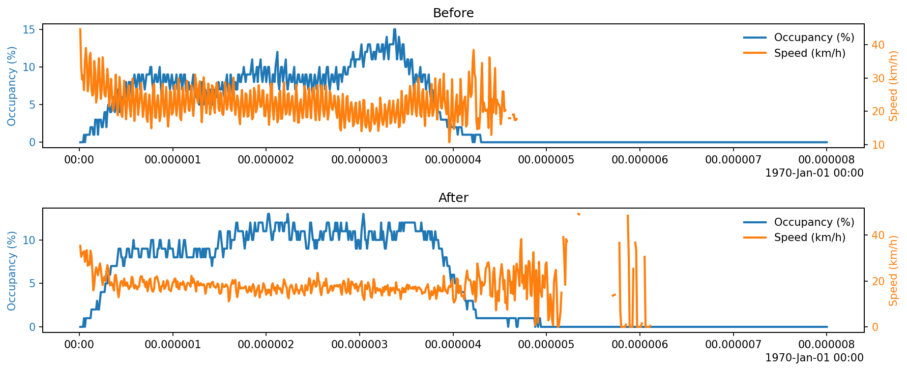 | Tổng quan tình trạng tắc nghẽn |
| 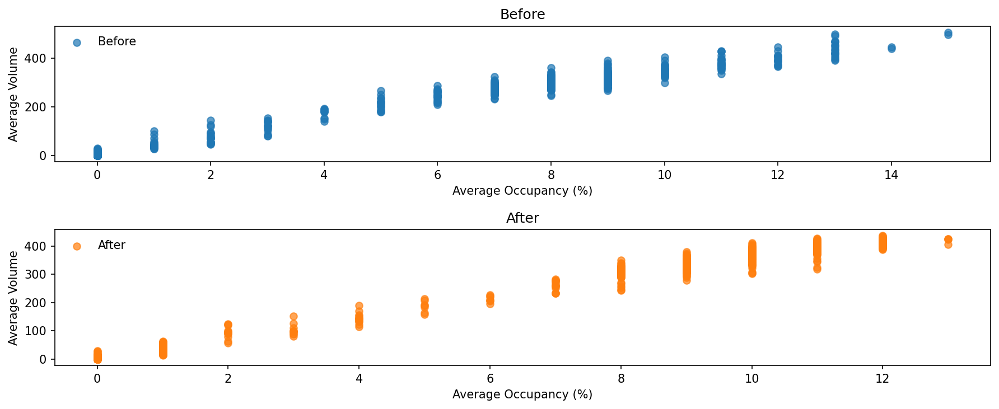 | Macroscopic Fundamental Diagram |
| 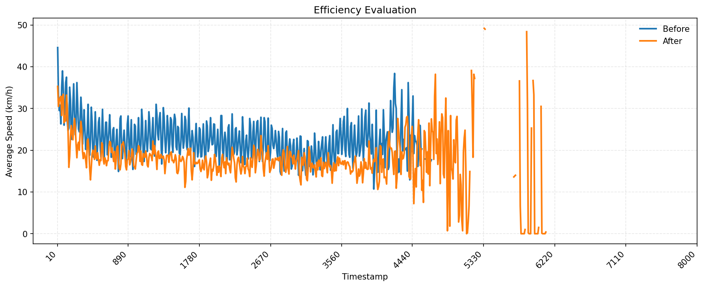 | So sánh hiệu quả tốc độ |
| 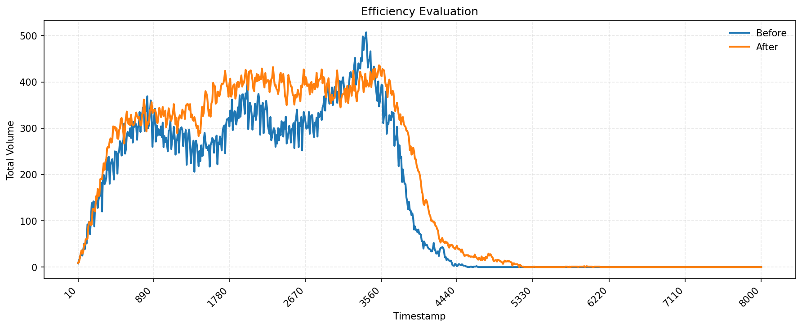 | So sánh hiệu quả lưu lượng |
| 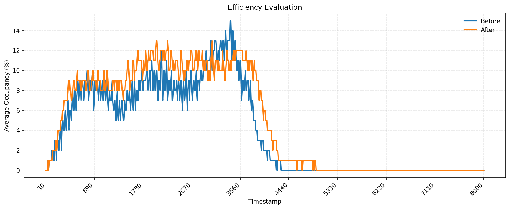 | So sánh hiệu quả mật độ chiếm đường |

#### 💡 Nhận xét & Kết luận
- Điểm mạnh:
  - Lưu lượng tăng 20.48%
  - Trong toàn bộ thời gian mô phỏng, mạng lưới không xảy ra tình trạng tắc nghẽn (theo tiêu chí đánh giá)
- Điểm yếu/Vấn đề:
  - Độ chiếm dụng trung bình tăng 21.68%
  - Thuật toán chưa hội tụ, bài test này chỉ là thử đánh giá.
- Kết luận:
  - Chưa thể kết luận mạng lưới có cải thiện hay chưa
  - Vấn đề là trong các hàm phần thưởng sử dụng, bao gồm cả: hàm phần thưởng liên quan đến lưu lượng và hàm phần thưởng liên quan đến độ chiếm dụng. Nhưng trong bài thử nghiệm này chỉ cải thiện lưu lượng.
- Hướng cải tiến tiếp theo:
  - Tăng nhu cầu giao thông và đánh giá lại.
  - Training đến khi hội tụ (có thê hơi lâu)

---

### Experiment #003 - 2026-01-20
**Mục tiêu:** Kiểm tra đánh giá trên checkpoint mới (checkpoint_000018)

#### 🔧 Tham số (Parameters)
| Tham số | Giá trị | Ghi chú |
|---------|---------|---------|
| `learning_rate` | | |
| `batch_size` | | |
| `gamma` | | |
| `num_episodes` | 1 | Đánh giá 1 episode (theo terminal history) |
| | | |

#### 📈 Kết quả (Results)
| Metric | Giá trị | So sánh với baseline |
|--------|---------|---------------------|
| Mean Reward |~ -682 | |
| Episode Length |89 | |
| Convergence Step |16h | |
| Training Time | | |

#### 📉 Biểu đồ (nếu có)

##### So sánh tổng hợp (Before vs After)
| Biểu đồ | Mô tả |
|---------|-------|
| 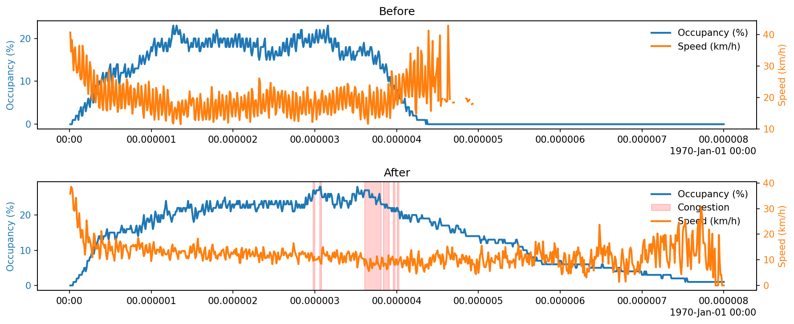 | Tổng quan tình trạng tắc nghẽn |
| 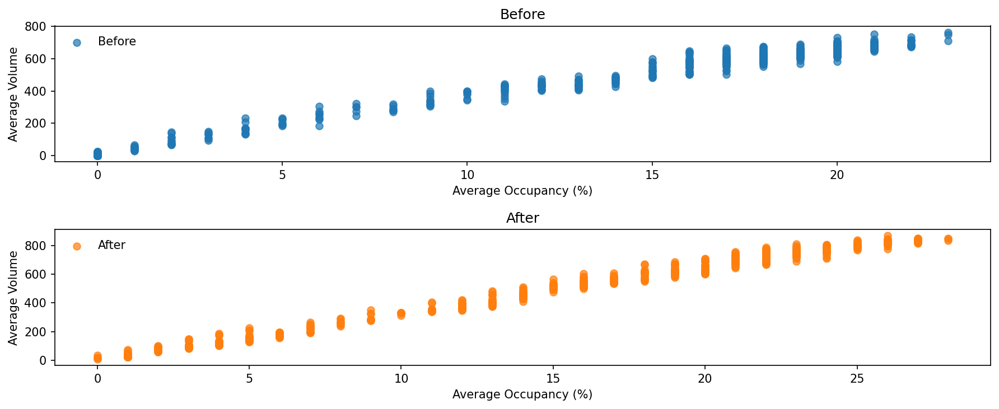 | Macroscopic Fundamental Diagram |
| 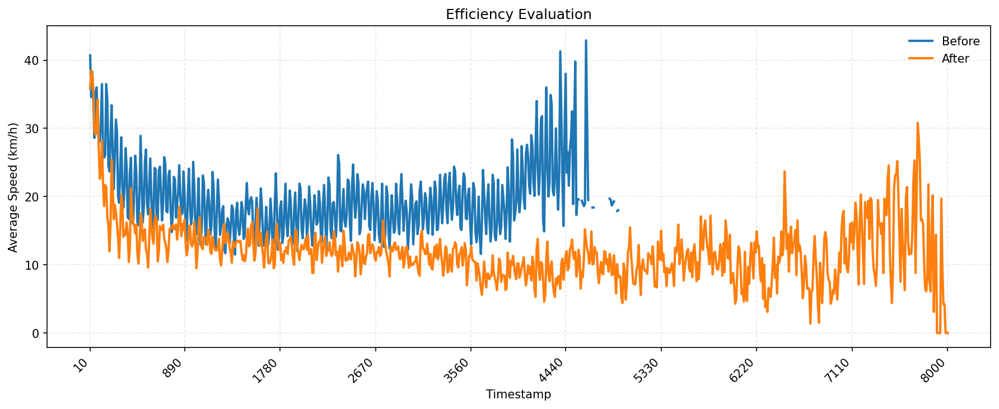 | So sánh hiệu quả tốc độ |
| 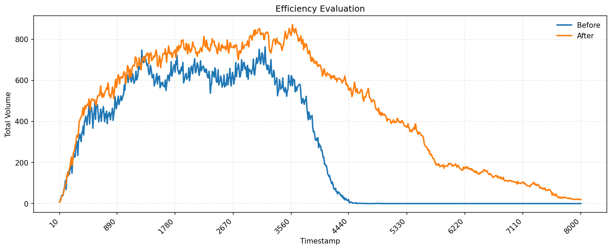 | So sánh hiệu quả lưu lượng |
| 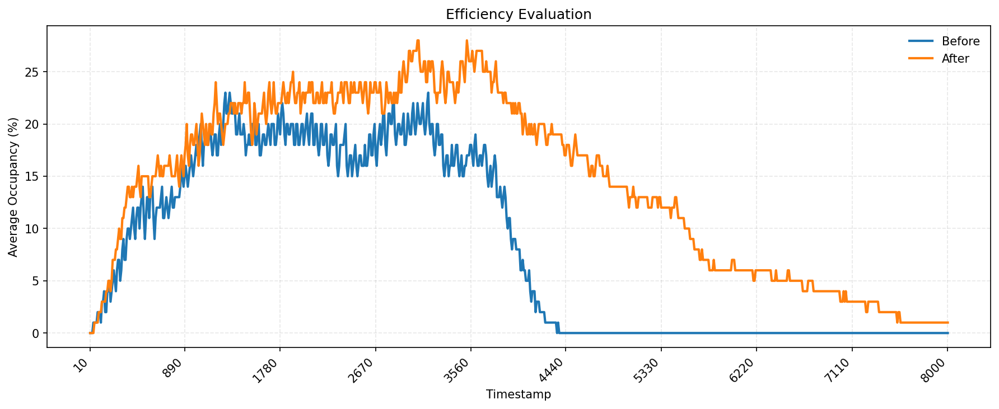 | So sánh hiệu quả mật độ chiếm đường |

#### 💡 Nhận xét & Kết luận
- Điểm mạnh:
  - Tổng lưu lượng tăng 69.3%
  - 
- Điểm yếu/Vấn đề:
  - Tuy lưu lượng tăng lớn, nhưng mạng lưới xuất hiện tình trạng tắc nghẽn
  - Độ chiếm dụng trung bình tăng 78%
- Kết luận:
  - Có thể kịch cách cấu hình mô phỏng khi chạy baseline và khi chạy thuật toán đang khác nhau.
- Hướng cải tiến tiếp theo:
  - Sửa lại cấu hình mô phỏng cho đồng nhât giữa chạy baselline và chạy thuật toán.

---

### Experiment #004 - 2026-01-22
**Mục tiêu:** Đánh giá hiệu quả thuật toán trên checkpoint mới, so sánh kết quả trước và sau với dữ liệu trong folder ket_qua/20260122_115608

#### 🔧 Tham số (Parameters)
| Tham số | Giá trị | Ghi chú |
|---------|---------|---------|
| `learning_rate` |0.0003  | |
| `batch_size` |  | |
| `gamma` |0.99  | |
| `num_episodes` | 1 | Đánh giá 1 episode |

#### 📈 Kết quả (Results)
| Metric | Giá trị | So sánh với baseline |
|--------|---------|---------------------|
| Mean Reward |~ -889| |
| Episode Length |8000s | |
| Convergence Step |  | |
| Training Time |33h35  | |

#### 📉 Biểu đồ (nếu có)

##### So sánh tổng hợp (Before vs After)
| Biểu đồ | Mô tả |
|---------|-------|
|  | Tổng quan tình trạng tắc nghẽn |
| 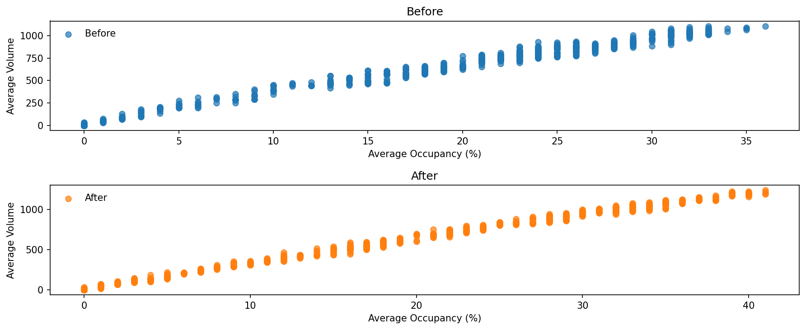 | Macroscopic Fundamental Diagram |
| 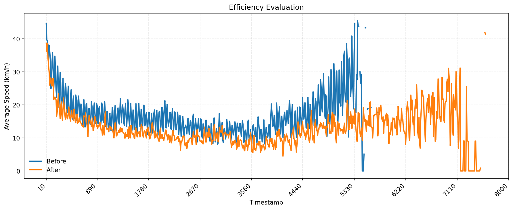 | So sánh hiệu quả tốc độ |
| 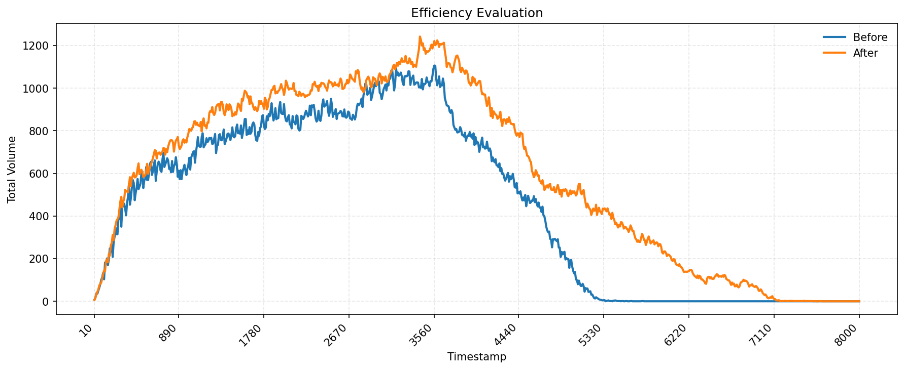 | So sánh hiệu quả lưu lượng |
| 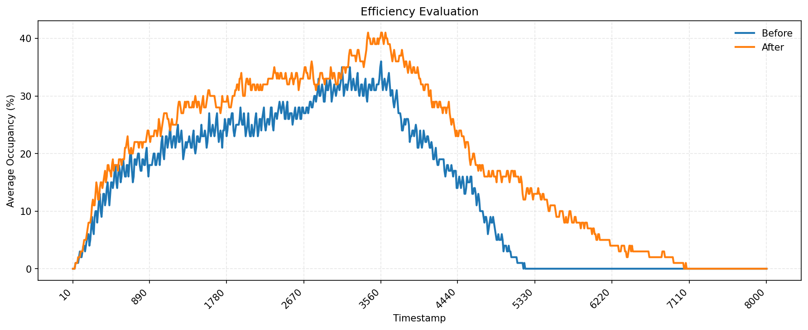 | So sánh hiệu quả mật độ chiếm đường |

#### 💡 Nhận xét & Kết luận
- Điểm mạnh:
  - Tổng lưu lượng tăng 31.59%
- Điểm yếu/Vấn đề:
  - Độ chiếm dụng trung bình tăng 39,91%
  - Sau khi áp dụng thuât toán, mạng lưới tắc nghẽn hơn, mặc dù lưu lượng tăng nhiều.
- Kết luận:
  - Vấn đề có lẽ nằm ở chỗ hàm phần thưởng. Hiện tại thuật toán đang rất ưu tiên tăng lưu lượng nhưng không quan tâm tới các yếu tố khác
  - Một vấn đề nữa là mean total reward đang khác nhau giữa các lần chạy đánh giá, mặc dù kịch bản, mạng lưới, và các thông số mô phỏng giống hệt nhau. (liệu có phải do seed?)
- Hướng cải tiến tiếp theo:
  - Xem và sửa lại các hàm phần thưởng sao cho chuẩn.

---

### Experiment #005 - 2026-02-09
**Mục tiêu:** Kiểm tra hiệu quả của Fix Action Masking và Cycle Time (v1.2.6).

#### 🔧 Tham số (Parameters)
| Tham số | Giá trị | Ghi chú |
|---------|---------|---------|
| `checkpoint` | `v0_2fe58` | Checkpoint mới sau khi fix mask? |
| `delta_time` | 90s | Cycle time |
| `min_green` | 5s | |
| `num_episodes` | 1 | Đánh giá sanity check |

#### 📈 Kết quả (Results)
| Metric | Giá trị | So sánh với baseline |
|--------|---------|---------------------|
| Mean Reward | -723.23 | |
| Episode Length | 67 | Crash do SUMO lỗi `free(): invalid pointer` (Known Issue) |
| Action Dist | **Distinct** | Std ~ 0.09 (Good). Đã thoát khỏi Uniform Policy. |

#### 💡 Nhận xét & Kết luận
- **Điểm mạnh**:
  - Agent đã đưa ra các hành động khác biệt (`[0.52, 0.75, ...]`) thay vì đều nhau (`0.5`).
  - Std của action distribution (~0.1) cho thấy agent đang thực sự khám phá không gian hành động.
- **Vấn đề**:
  - SUMO Simulation bị crash (`free(): invalid pointer`) khi chạy eval. Có thể do `teleport` hoặc xung đột luồng khi log metrics quá nhiều.
  - Cần retrain lâu hơn để agent học policy tối ưu (hiện tại hành động đã distinct nhưng reward vẫn âm).

---

### Experiment #006 - 2026-03-04
**Mục tiêu:** Đánh giá hệ thống v2.0+ hoàn chỉnh (Masked Softmax + MGMQ-PPO + GESA + DiagnosticCallback) trên test network (3 nút giao).

#### 🔧 Tham số (Parameters)
| Tham số | Giá trị | Ghi chú |
|---------|---------|---------|
| `network` | test (B3, C3, D3) | 3 nút giao |
| `learning_rate` | 0.0003 | |
| `train_batch_size` | 960 | 3 agents × 40 steps × 8 eps |
| `gamma` | 0.995 | $0.995^{90} \approx 0.64$ |
| `cycle_time` | 90s | |
| `num_seconds` | 3600s | 1 giờ simulation |
| `iterations` | 200 (167 completed) | ~17.5 giờ training |
| `num_workers` | 4 | |
| `seed` | 42 (train), [100,200,300,400,500] (eval) | |
| `reward_fn` | halt-veh + diff-wait + diff-depart | weights [0.5, 0.2, 0.3] |
| `action_dist` | masked_softmax | T=0.3 |
| `normalize_reward` | true (train), false (eval) | |
| `checkpoint_eval` | checkpoint_000032 | |

#### 📈 Kết quả (Results)
| Metric | AI (ckpt 32) | Baseline (fixed) | Cải thiện |
|--------|-------------|-----------------|-----------|
| Mean Raw Reward | **-41.17 ± 11.40** | -52.96 ± 11.90 | **+22.3%** ✅ |
| Min Raw Reward | -63.28 | — | |
| Max Raw Reward | -32.81 | — | |
| Episode Length | 40 steps | 40 steps | same |
| Eval Seeds | [100,200,300,400,500] | [100,200,300,400,500] | fair comparison |

**Per-Agent Rewards (raw):**
| Agent | Raw Reward | Ghi chú |
|-------|-----------|---------|
| B3 | -10.53 | Tốt |
| C3 | -19.05 | Yếu nhất (topology issue?) |
| D3 | -11.59 | Tốt |

**Training Diagnostics (Iter 167):**
| Metric | Giá trị | Đánh giá |
|--------|---------|----------|
| `vf_explained_var` | 0.824 | ✅ Rất tốt |
| `entropy` | -0.59 | ⚠️ Policy collapse |
| `episode_reward_mean` (norm) | +1.39 | ✅ Tăng từ -60.19 |
| `kl_coeff` | tăng nhanh | ⚠️ kl_target quá nhỏ |

#### 💡 Nhận xét & Kết luận
- Điểm mạnh:
  - **Vượt ngưỡng mục tiêu 20%** cải thiện so với baseline ngay tại checkpoint 32.
  - Value function học rất tốt (`vf_explained_var = 0.824`).
  - Hệ thống v2.0+ hoàn chỉnh hoạt động đúng: Masked Softmax → valid masking, GESA → clean eval, DiagnosticCallback → phát hiện vấn đề.
  - Multi-seed eval (5 seeds) cho kết quả tin cậy.
- Điểm yếu/Vấn đề:
  - **Entropy âm**: Policy quá deterministic, `kl_coeff` tăng quá nhanh.
  - **C3 yếu hơn** B3/D3 nhiều — có thể do vị trí topology giữa mạng.
  - raw_reward_mean dao động (-42 → -46) dù normalized reward cải thiện → normalizer drift.
- Kết luận:
  - Hệ thống v2.0+ **đã chứng minh hiệu quả** trên test network nhỏ.
  - Masked Softmax + MGMQ-PPO là combination đúng đắn.
  - GESA wrapper giúp eval clean, DiagnosticCallback phát hiện entropy collapse sớm.
- Hướng cải tiến tiếp theo:
  - Fix entropy collapse: tăng `kl_target` (0.01 → 0.03), thêm `entropy_coeff_schedule`, hoặc clamp `log_std ≥ -3.0`.
  - Áp dụng v2.0 lên grid4x4 (16 agents) để validate scalability.
  - Investigate C3 yếu: có thể cần per-agent reward analysis.

<!--
### Experiment #XXX - YYYY-MM-DD
**Mục tiêu:** 

#### 🔧 Tham số (Parameters)
| Tham số | Giá trị | Ghi chú |
|---------|---------|---------|
| `learning_rate` | | |
| `batch_size` | | |
| `gamma` | | |
| `num_episodes` | | |
| | | |

#### 📈 Kết quả (Results)
| Metric | Giá trị | So sánh với baseline |
|--------|---------|---------------------|
| Mean Reward | | |
| Episode Length | | |
| Convergence Step | | |
| Training Time | | |

#### 📉 Biểu đồ (nếu có)

#### 💡 Nhận xét & Kết luận
- Điểm mạnh:
  - 
- Điểm yếu/Vấn đề:
  - 
- Kết luận:
  - 
- Hướng cải tiến tiếp theo:
  - 

---
-->

---

## 🔖 Bảng So Sánh Nhanh (Quick Comparison)

| Experiment | Date | Key Params | Mean Raw Reward | Best? | Notes |
|------------|------|------------|-----------------|-------|-------|
| #002 | 2026-01-19 | lr=0.0003, bs=1424, grid4x4 | ~ -145 | | Baseline cũ |
| #003 | 2026-01-20 | grid4x4, ckpt_18 | ~ -682 | | Nhu cầu GT thấp |
| #004 | 2026-01-22 | grid4x4, heavy traffic | ~ -889 | | Nhu cầu GT cao |
| #005 | 2026-02-09 | v1.2.6, fix mask+cycle | ~ -723 | | SUMO crash, action distinct |
| #006 | 2026-03-04 | **v2.0+**, test network, 5 seeds | **-41.17** | ⭐ | **+22.3% vs baseline (-52.96)** |
| Baseline | 2026-03-03 | test network, fixed signal, 5 seeds | -52.96 | | Baseline test network |

## 📝 Bảng Tracking Version Code

| Version | Date | Main Changes | Scope | Status |
|---------|------|------------|-------|--------|
| v1.0.0 | 2026-01-17 | Phiên bản khung dự án | Foundation | ✅ |
| v1.1.0 | 2026-01-18 | Episode-based training config | Configuration | ✅ |
| v1.1.1 | 2026-01-18 | Fix cấu hình đồng nhất | Config fix | ✅ |
| v1.1.2 | 2026-01-23 | Log(std) bounds + GraphSAGE review | Model | ✅ |
| v1.2.0 | 2026-01-23 | **Directional Adjacency Matrix** | **Major** | ✅ |
| v1.2.1 | 2026-01-23 | Code cleanup & Docstrings | Quality | ✅ |
| v1.2.2 | 2026-01-27 | **Fix Observation Structure (Lane-major)** | **Critical Fix** | ✅ |
| v1.2.3 | 2026-01-29 | **Fix Detector Order (L-T-R)** | **Critical Fix** | ✅ |
| v1.2.4 | 2026-01-30 | **Fix Scale Ambiguity (Softmax Output)** | **Model Logic** | ✅ |
| v1.2.5 | 2026-01-30 | **Fix Dirichlet & GAT Topology** | **Model Logic** | ✅ |
| v1.2.6 | 2026-02-09 | **Fix Action Masking & Cycle Length** | **Critical Fix** | ✅ |
| **v2.0.0** | **2026-02-15** | **MaskedSoftmax, MGMQ-PPO, GESA, DiagnosticCallback** | **🔥 Major Rewrite** | ✅ |
| v2.0.1 | 2026-03-03 | Seed strategy, test network switch | Config | ✅ |
| v2.0.2 | 2026-03-04 | Training results: **+22.3% vs baseline** | Evaluation | ✅ **LATEST** |

---

## 📒 Ghi Chú Chung

### Lessons Learned
- Reward_mean có thể khác nhau lớn giữa các lần training do kịch bản nhu cầu giao thông khác nhau.
- **[v1.2.0]** Lỗi logic vật lý trong GraphSAGE: Trước đây sử dụng một ma trận kề duy nhất cho tất cả hướng dẫn đến nhầm lẫn thông tin spatial. Bây giờ sử dụng ma trận riêng cho từng hướng, chính xác hơn về vật lý.
- Khi thiết kế GNN cho mô phỏng giao thông, cần phân biệt rõ hướng (direction) của neighbor để mô hình có thể học được pattern spatial phức tạp.
- **[v2.0.0]** Dirichlet Distribution không phù hợp cho action masking: post-hoc masking (multiply by 0, renormalize) chỉ xấp xỉ bằng 0, gây waste gradient. Masked Softmax giải quyết triệt để.
- **[v2.0.0]** Per-minibatch advantage normalization là **critical** cho multi-agent training: advantage variance lớn (16+ agents) gây KL spike → `kl_coeff` tăng không kiểm soát → policy bị freeze.
- **[v2.0.0]** GESA Wrapper pattern (tách normalization ra khỏi env) giúp eval clean hơn nhiều: chỉ cần set flag → skip wrapper → raw reward.
- **[v2.0.1]** Multi-seed evaluation (5 seeds) giúp giảm variance kết quả đánh giá rất nhiều so với single-seed.
- **[v2.0.2]** Entropy âm là dấu hiệu policy collapse — cần theo dõi `kl_coeff` growth rate và `log_std` bounds.

### TODO / Ideas
- [x] ~~**Training tiếp theo**: Huấn luyện mô hình với directional adjacency mới để kiểm tra hiệu quả cải thiện~~
- [x] ~~**Masked Softmax**: Thay thế Dirichlet Distribution bằng Masked Softmax~~
- [x] ~~**MGMQ-PPO**: Custom PPO với per-minibatch advantage normalization~~
- [x] ~~**GESA Wrapper**: Tách normalization ra khỏi env~~
- [x] ~~**Multi-seed eval**: 5 seeds cho reproducibility~~
- [x] ~~**Test network**: Mạng lưới nhỏ cho iteration nhanh~~
- [ ] **Fix entropy collapse**: Tăng `kl_target` (0.01 → 0.02~0.05), thêm `entropy_coeff_schedule`, hoặc lower-bound cho `log_std`
- [ ] **Ablation Study**: Tắt directional adjacency / GESA / reward normalization
- [ ] **Training trên grid4x4**: Áp dụng v2.0 lên mạng 16 nút giao sau khi validate trên test network
- [ ] **Heavy traffic**: Test trên `grid4x4-heavy.rou.xml` với lưu lượng cao
- [ ] **Mở rộng**: Xem xét thêm thông tin edge type (highway vs local road) vào adjacency matrix
- [ ] **GPU training**: Tối ưu hóa cho GPU training với batch size lớn hơn

### Tài liệu tham khảo
- Hamilton et al., "Inductive Representation Learning on Large Graphs", NeurIPS 2017
- Schulman et al., "Proximal Policy Optimization Algorithms", arXiv 2017
- Zheng et al., "FRAP: Learning Phase Competition for Traffic Signal Control", CIKM 2019
- SUMO Network File Format: https://sumo.dlr.de/docs/Networks/index.html
- GESA (General Environment Standardization Architecture): Internal design pattern for composable env wrappers

---

> **Hướng dẫn sử dụng:**
> 1. **Changelog:** Mỗi khi thay đổi code, copy template trong comment và điền thông tin
> 2. **Experiment:** Mỗi lần thử nghiệm tham số mới, copy template experiment và ghi kết quả
> 3. **Quick Comparison:** Cập nhật bảng so sánh nhanh để dễ nhìn tổng quan
> 4. Đánh số version theo format: `vMajor.Minor.Patch` (ví dụ: v1.0.0, v1.1.0, v2.0.0)
> 5. Đánh số experiment theo thứ tự: #001, #002, ...
